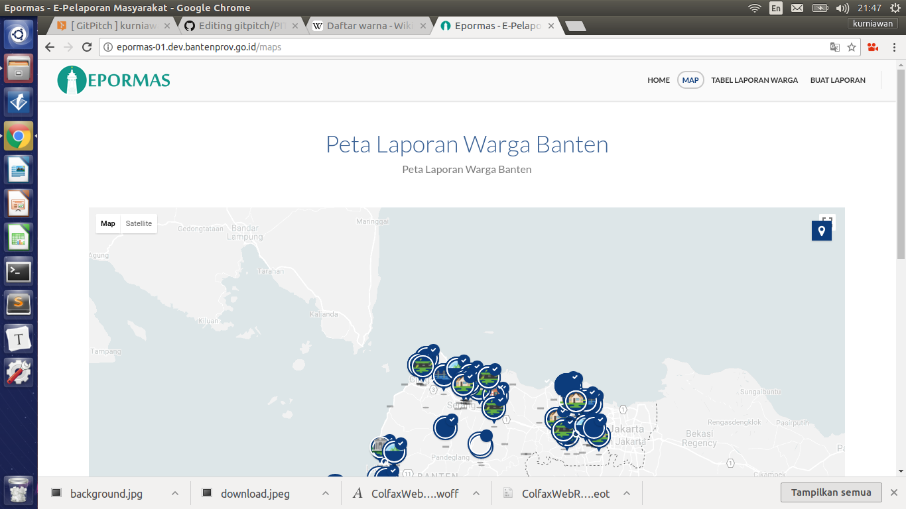
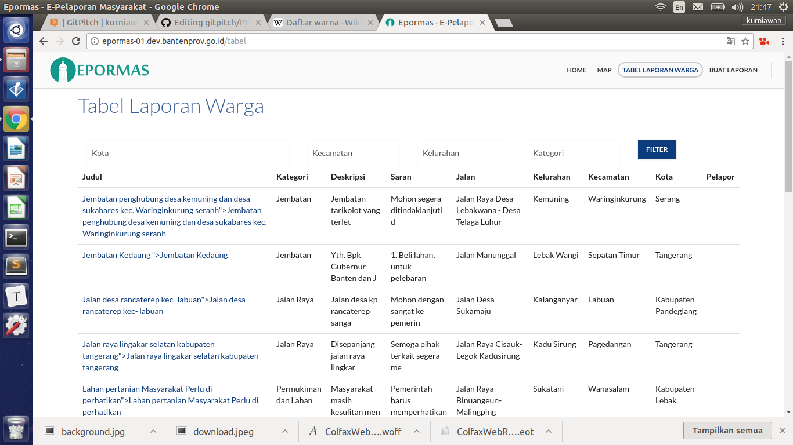
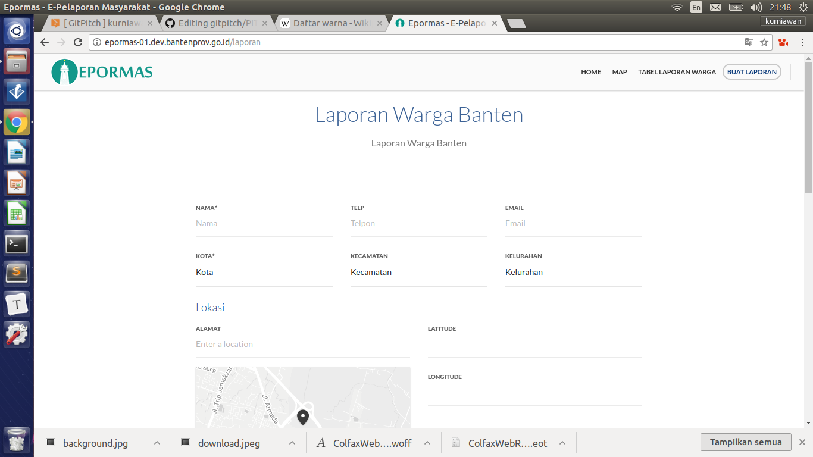

## Website dan Aplikasi Epormas

---

### Layanan Online Epormas
- EPORMAS adalah sebuah aplikasi yang berbasis webite dan android yang dikeluarkan oleh Pemerintah Provinsi Banten untuk mendukung terlaksananya proses pengaduan atau keluhan yang mewadahi atau dapat menjadi suatu alat informasi bagi masyarakat dalam menyampaikan informasi keluhan atau pengaduan yang dialami oleh masyarakat kepada dinas-dinas terkait agar proses perbaikan nya cepat dan terorganisir karena memanfaatkan sistem berbasis web dan android. |

---

### Tujuan Layanan Epormas
- peningkatan kualitas pelayanan publik sangat diperlukan dalam rangka membangun kepercayaan (trust) masyarakat, dengan menjadikan keluhan atau pengaduan sebagai sarana untuk perbaikan pelayanan publik 

@fa[arrow-down] +++ @title[Konten Slideshow]
---

- pengguna memerlukan pelayanan yang transparan, akuntabel sesuai standar pelayanan berdasarkan persamaan perlakuan dan keterjangkauan masyarakat |

+++

- peningkatan kualitas pelayanan publik berbasis partisipasi masyarakat diharapkan akan memberikan kontribusi dan manfaat dalam rangka mewujudkan good public service governance. |

--- 
### Tampilan website Epormas
#### Tampilan Awal

+++

#### Laporan Warga

---

#### Map (peta laporan warga pelapor)

---

#### Tabel Laporan Warga

---

#### Buat Laporan

