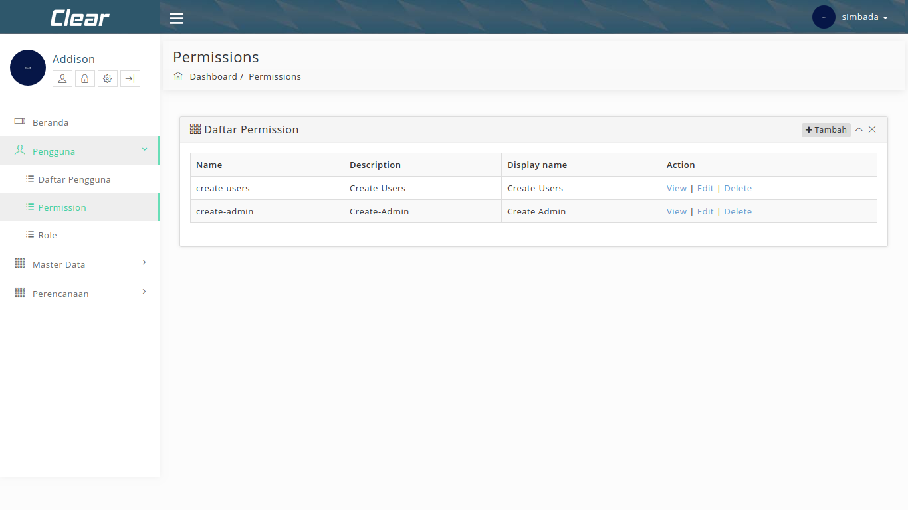
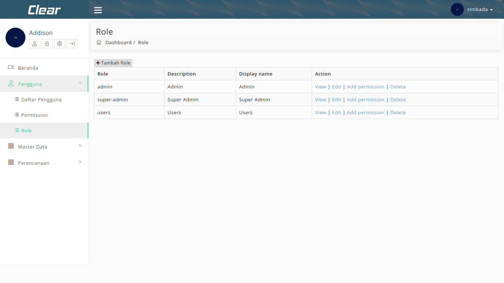
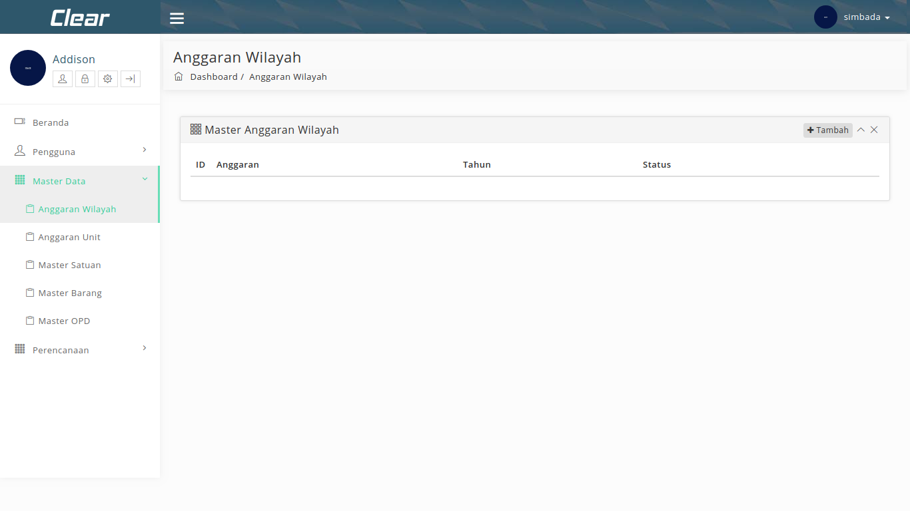
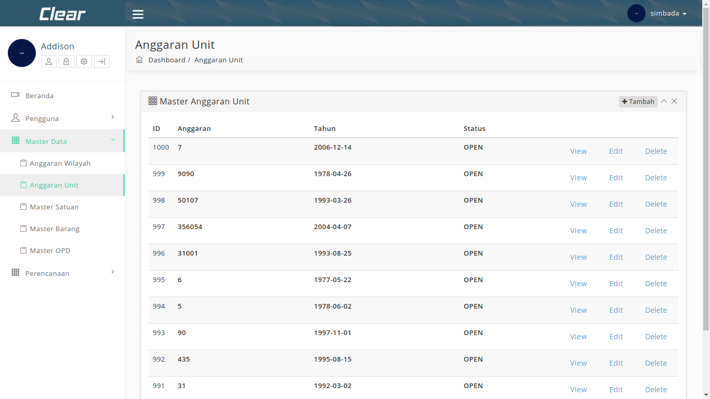
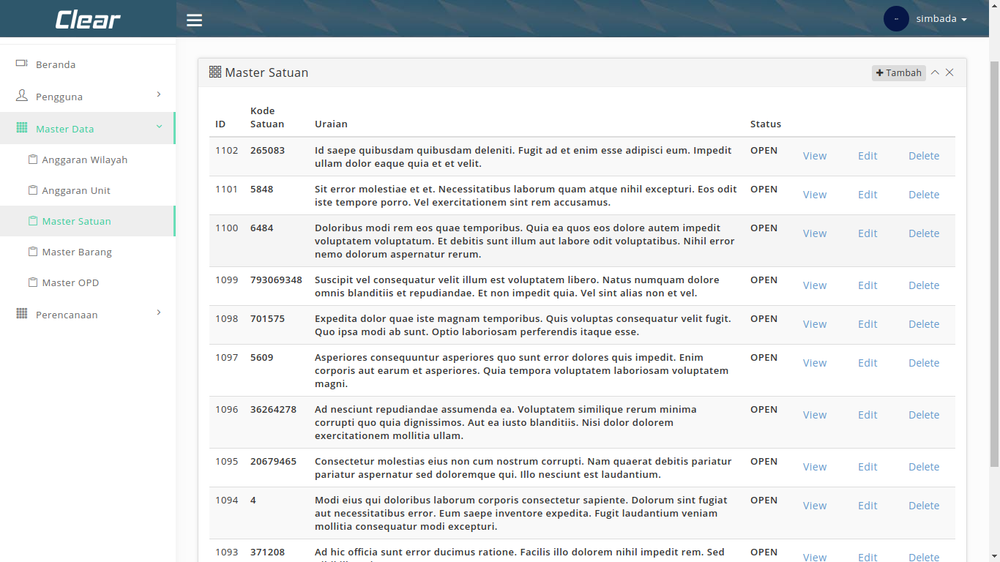
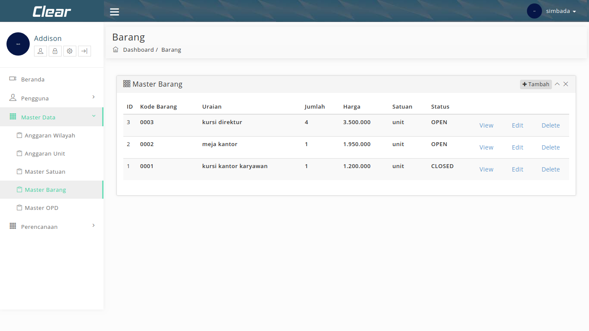
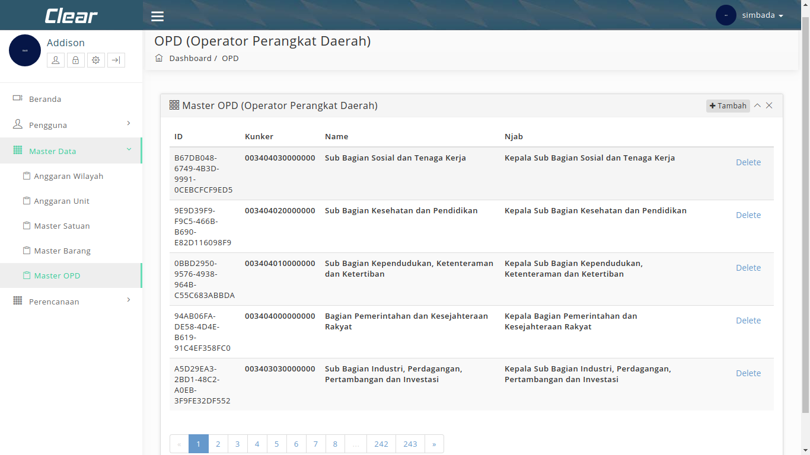

## Aplikasi Sistem Informasi Barang Daerah SIMBADA 

---

### Aplikasi Simbada
SIMBADA adalah sebuah aplikasi Sistem Informasi Manajemen Aset Barang Daerah yang berbasis webite yang dikeluarkan oleh Pemerintah Provinsi Banten untuk mendukung menatausahakan barang inventaris milik negara di lingkungan pemerintahan (Kabupaten/Kota/Provinsi).

---

### Manfaat Aplikasi Simbada
- Memudahkan mengakses informasi barang daerah |
- Ketaatan kepada peraturan pengelolaan barang daerah/barang milik negara yang berlaku |
- Keakuratan penghitungan nilai-nilai dalam semua dokumen/laporan yang dihasilkan |

---

### Tujuan Dashboard Pimpinan
- Meningkatkan mutu perencanaan, penganggaran, pengadaan, pemeliharaan, pemanfaatan maupun distribusi barang daerah |
- Untuk mendapatkan data barang daerah yang benar dan akurat |
- Meningkatkan pengawasan atas penggunaan barang daerah |

--- 

### Tampilan website Simbada

Tampilan Beranda.
@fa[arrow-down]

+++

#### Tampilan Beranda Simbada

---

### Tampilan Menu Pengguna
Tampilan Pengguna.
@fa[arrow-down]

+++

#### Tampilan Daftar Pengguna

+++

#### Tampilan Permission

+++

#### Tampilan Role

---

### Tampilan Menu Master Data
Selanjutnya
@fa[arrow-down]

+++

#### Tampilan Anggaran Wilayah

+++ 

#### Tampilan Anggaran Unit

+++

#### Tampilan Master Satuan

+++

#### Tampilan Master Barang

+++

#### Tampilan master OPD

---

### Tampilan Menu Perencanaan
Selanjutnya RKBU/RKPBU
@fa[arrow-down]

+++

#### Tanah
Selanjutnya
@fa[arrow-down]

+++ 

##### Jalan dan Jembatan

+++

##### Bangunan Air

+++

##### Instalasi

+++

##### Jaringan 

+++

##### Bangunan Gedung

+++

##### Monumen

---

#### Kendaraan
Selanjutnya
@fa[arrow-down]

+++ 

##### Alat Besar

+++

##### Alat Angkut

---

#### Lain-lain
Selanjutnya
@fa[arrow-down]

+++

##### Alat Bengkel

+++

##### Alat Pertanian

+++

##### Alat Kantor

+++

##### Alat Studio'

+++

##### Alat Kedokteran

+++

##### Alat Laboratorium

+++

##### Buku/perpustakaan

+++

##### Kesenian dan Kebudayaan

+++

##### Hewan dan Tumbuhan

+++

##### Alat Keamanan

---

### Tampilan Menu Perencanaan
Selanjutnya RTBU/RTPBU
@fa[arrow-down]

---

### Tampilan Menu Perencanaan
Selanjutnya Laporan
@fa[arrow-down]

---

### SEKIAN
## Dinas KominfoST

#### Seksi Pengembangan Aplikasi Informatika.*
